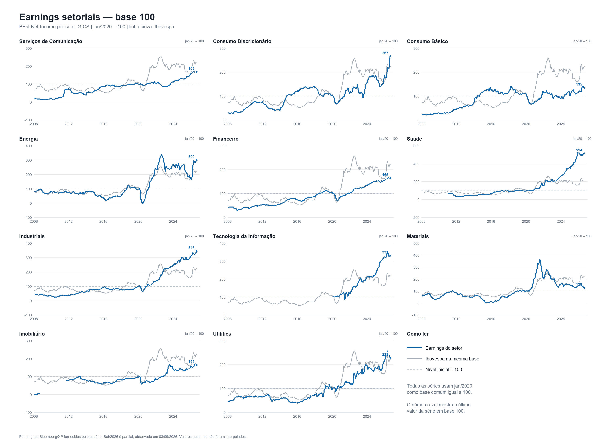

# Earnings 12 meses à frente do Ibovespa e variáveis macro

Este diretório reúne as séries mensais de earnings 12 meses à frente do Ibovespa e dos setores GICS, os testes de sensibilidade a variáveis macroeconômicas e os diagnósticos de robustez realizados em setembro de 2026.

O objetivo é explicar revisões contemporâneas de earnings, não prever retornos de ações. Todos os resultados devem ser lidos como associações condicionais, sem interpretação causal.

## Principais conclusões

1. Revisões positivas do Focus PIB estão associadas a revisões positivas do earnings do Ibovespa. O resultado é forte na amostra histórica, mas enfraquece em amostras recentes.
2. O IPCA realizado em 12 meses, disponível na data da observação, foi marginalmente melhor que a expectativa de IPCA. A diferença é pequena e nenhuma das alternativas é robusta à retirada de 2020–21.
3. O coeficiente contemporâneo do swap pré-DI de 360 dias aparece positivo em algumas especificações. O sinal não é estável entre amostras e não deve ser interpretado como efeito causal positivo de juros maiores sobre lucros.
4. Energia apresenta o maior beta setorial ao Focus na amostra histórica. A decomposição mostra que o resultado é essencialmente Petrobras.
5. Fora de Petrobras, o Brent explica melhor as revisões recentes de empresas de Energia do que o Focus PIB.
6. O Ibovespa ex-commodities tem beta ao Focus menor, e não maior, que o Ibovespa completo.

## Arquivos

### Dados

| Arquivo | Conteúdo |
|---|---|
| `data/earnings_12m_fwd_sector_monthly.csv` | Níveis mensais de BEst Net Income do IBOV e dos setores GICS, em BRL |
| `data/earnings_revisions_3m_sector_monthly.csv` | Revisões de três meses, calculadas como `100 × ln(Earnings_t / Earnings_t-3)` |
| `data/earnings_12m_fwd_sector_base100_2020_01.csv` | Séries setoriais em base 100 em janeiro de 2020 |
| `data/macro_and_ibov_eps_monthly.csv` | BEst EPS do IBOV, cesta constante e variáveis macro mensais usadas nas regressões |
| `data/energy_company_earnings_12m_fwd_monthly.csv` | Earnings de Petrobras, PRIO, Brava, PetroReconcavo e proxies ex-Petrobras |
| `data/sources.csv` | Fontes, períodos, URLs e hashes disponíveis |

### Resultados

| Arquivo | Conteúdo |
|---|---|
| `results/ibov_contemporaneous_coefficients.csv` | Coeficientes do modelo contemporâneo do BEst EPS do IBOV |
| `results/inflation_candidate_comparison.csv` | Comparação entre IPCA esperado e realizado |
| `results/focus_swap_sensitivity_matrix.csv` | Matriz de sensibilidade conjunta Focus PIB–swap 360 dias |
| `results/swap_sign_robustness.csv` | Diagnóstico do sinal do swap por amostra e especificação |
| `results/sector_regressions.csv` | Regressões completas para IBOV e 11 setores GICS |
| `results/sector_seam_diagnostics.csv` | Revisões que atravessam as emendas dos arquivos históricos |
| `results/ibov_vs_excommodities_focus.csv` | Comparação IBOV, IBOV ex-commodities e commodities |
| `results/energy_petrobras_brent_regressions.csv` | Energia, Petrobras e empresas ex-Petrobras com BCOM ou Brent |
| `results/energy_petrobras_brent_summary.json` | Cobertura, concentração e correlações da decomposição de Energia |

O workbook completo está em `workbook/ibovespa_earnings_macro_consolidado.xlsx`. Ele reúne resumo executivo, sensibilidades do índice e dos setores, matriz Focus–swap, inflação, ex-commodities, decomposição de Energia, séries mensais, regressões, diagnósticos e fontes em 18 abas.

A planilha de apoio com apenas as séries setoriais permanece em `workbook/earnings_12m_fwd_sector_2008_2026.xlsx`.



## Duas séries de earnings do IBOV

Há duas construções diferentes no estudo:

- **BEst EPS do índice:** série direta do Ibovespa usada na escolha da inflação, no diagnóstico do swap e na matriz Focus–swap.
- **BEst Net Income agregado:** série reportada nos grids setoriais, usada para comparar o IBOV com os setores GICS.

As duas variáveis entram nas regressões como revisão logarítmica de três meses. Essa transformação torna os resultados economicamente comparáveis, mas os níveis e os coeficientes não são idênticos.

## Especificação contemporânea

O modelo principal é:

```text
100 × ln(Earnings_t / Earnings_t-3)
    = α
    + β1 × Δ3m Focus PIB 12m móvel
    + β2 × Δ3m ln(BCOM USD)
    + β3 × Δ3m ln(USD/BRL)
    + β4 × Δ3m IPCA 12m disponível
    + β5 × Δ3m swap pré-DI 360d
    + erro
```

Detalhes:

- Frequência mensal.
- Variáveis observadas contemporaneamente no fechamento de cada mês.
- O IPCA realizado é deslocado em um mês para utilizar apenas informação já publicada.
- OLS com erros-padrão HAC/Newey-West de seis defasagens.
- Amostra principal: abril de 2009 a julho de 2026, excluindo 2013–14.
- Revisões com earnings não positivo em um dos extremos não recebem transformação logarítmica.
- Nas regressões setoriais, os q-values usam Benjamini-Hochberg separadamente por variável entre os 11 setores.

## Escolha da inflação

A comparação inicial adiciona cada medida de inflação ao modelo com Focus PIB e BCOM em BRL. Resultados da amostra principal:

| Inflação | n | Acréscimo de R² | Beta padronizado | p HAC |
|---|---:|---:|---:|---:|
| Revisão do Focus IPCA | 185 | 0,070 | 0,281 | 0,009 |
| Variação do IPCA realizado em 12 meses, disponível | 184 | **0,078** | **0,287** | **0,009** |
| IPCA realizado acumulado em três meses, disponível | 184 | 0,054 | 0,235 | 0,062 |

O IPCA realizado em 12 meses foi escolhido por apresentar o maior ganho de R². A vantagem sobre o Focus IPCA é pequena. Excluindo simultaneamente 2013–14 e 2020–21, os p-valores passam para 0,328 e 0,307, respectivamente. A evidência de inflação não é estrutural.

## Modelo completo do BEst EPS do IBOV

Amostra principal, `n=184`, `R²=0,493`:

| Variável | Beta | Beta padronizado | p HAC |
|---|---:|---:|---:|
| Δ Focus PIB, p.p. | **6,003** | **0,594** | <0,001 |
| Retorno BCOM USD, % | 0,137 | 0,116 | 0,326 |
| Retorno USD/BRL, % | 0,043 | 0,035 | 0,731 |
| Δ IPCA 12m disponível, p.p. | 1,547 | 0,190 | 0,058 |
| Δ swap 360d, p.p. | **1,731** | **0,208** | **0,008** |

Um aumento de 1 p.p. no Focus PIB está associado a uma revisão de aproximadamente 6,0% no earnings, mantendo os demais regressores constantes.

## Matriz Focus PIB–swap

A matriz usa os coeficientes do modelo completo acima e mostra a revisão de earnings atribuída apenas à combinação Focus–swap, em pontos percentuais.

| Δ Focus PIB | Swap −3 p.p. | −2 p.p. | −1 p.p. | 0 p.p. | +1 p.p. | +2 p.p. | +3 p.p. |
|---:|---:|---:|---:|---:|---:|---:|---:|
| −1,00 p.p. | −11,2 | −9,5 | −7,7 | −6,0 | −4,3 | −2,5 | −0,8 |
| −0,75 p.p. | −9,7 | −8,0 | −6,2 | −4,5 | −2,8 | −1,0 | 0,7 |
| −0,50 p.p. | −8,2 | −6,5 | −4,7 | −3,0 | −1,3 | 0,5 | 2,2 |
| −0,25 p.p. | −6,7 | −5,0 | −3,2 | −1,5 | 0,2 | 2,0 | 3,7 |
| 0,00 p.p. | −5,2 | −3,5 | −1,7 | 0,0 | 1,7 | 3,5 | 5,2 |
| +0,25 p.p. | −3,7 | −2,0 | −0,2 | 1,5 | 3,2 | 5,0 | 6,7 |
| +0,50 p.p. | −2,2 | −0,5 | 1,3 | 3,0 | 4,7 | 6,5 | 8,2 |

### Por que o beta do swap não implica causalidade

O coeficiente do swap muda materialmente entre amostras no mesmo modelo completo:

| Amostra | Beta swap | p HAC |
|---|---:|---:|
| Completa | 0,841 | 0,457 |
| Excluindo 2013–14 | 1,731 | 0,008 |
| Excluindo 2020–21 | 0,170 | 0,906 |
| Excluindo 2013–14 e 2020–21 | 1,315 | 0,085 |
| Desde 2022 | 0,135 | 0,882 |

O sinal positivo pode refletir ciclo, composição do índice, bancos, inflação nominal e variáveis omitidas. A matriz é uma leitura mecânica do modelo histórico, não uma afirmação de que juros maiores causam lucros maiores.

## Resultados por setor

Os betas abaixo são padronizados e vêm do modelo com Focus PIB, BCOM USD, USD/BRL, IPCA realizado e swap. A amostra principal exclui 2013–14.

| Setor | n | R² | Focus | BCOM | USD/BRL | IPCA | Swap |
|---|---:|---:|---:|---:|---:|---:|---:|
| Energy | 182 | 0,499 | **0,630** | 0,125 | 0,076 | 0,192 | 0,189 |
| IBOV | 184 | 0,438 | 0,430 | 0,382 | 0,178 | 0,278 | 0,063 |
| Real Estate | 152 | 0,276 | 0,384 | −0,176 | −0,343 | −0,092 | 0,238 |
| Consumer Discretionary | 184 | 0,264 | **0,354** | 0,051 | −0,091 | 0,214 | 0,158 |
| Industrials | 184 | 0,134 | 0,268 | 0,022 | 0,161 | −0,013 | 0,272 |
| Financials | 184 | 0,141 | **0,251** | 0,024 | −0,101 | 0,158 | 0,107 |
| Materials | 182 | 0,032 | **0,166** | 0,044 | 0,023 | −0,034 | 0,004 |
| Utilities | 184 | 0,043 | 0,125 | 0,207 | 0,144 | 0,012 | −0,101 |
| Consumer Staples | 184 | 0,102 | 0,095 | 0,049 | −0,133 | 0,176 | 0,107 |
| Health Care | 160 | 0,144 | −0,054 | 0,090 | −0,230 | 0,026 | 0,259 |
| Communication Services | 184 | 0,076 | −0,076 | −0,085 | −0,241 | 0,244 | −0,012 |
| Information Technology | 76 | 0,025 | −0,106 | 0,002 | −0,154 | −0,090 | 0,054 |

Em negrito estão os setores cujo beta Focus tem `q<10%`: Energy, Consumer Discretionary, Financials e Materials. Nenhum beta setorial do swap passa o mesmo critério na amostra principal.

### Robustez setorial

Excluindo também 2020–21 e as janelas que atravessam emendas dos grids:

- Energy permanece positivo ao Focus, com beta bruto de 9,98 e `q=0,094`.
- Consumer Discretionary e Financials perdem significância.
- Industrials muda de sinal e fica significativamente negativo.
- Desde 2022, nenhum beta setorial ao Focus é significativo após correção por múltiplos testes.

## Ibovespa ex-commodities

| Amostra | Beta Focus IBOV | Beta ex-commodities | Beta commodities | Diferença ex-commodities − IBOV | p da diferença |
|---|---:|---:|---:|---:|---:|
| Excluindo 2013–14 | 5,686 | 2,032 | 16,776 | **−3,655** | <0,001 |
| Excluindo 2013–14 e 2020–21 | 2,866 | 0,510 | 11,169 | **−2,356** | <0,001 |
| Desde 2022 | 2,120 | 1,078 | 3,241 | −1,042 | 0,471 |

O beta do IBOV ex-commodities é menor. A sensibilidade agregada do índice ao Focus é elevada pelo bloco de commodities.

## Energia, Petrobras e Brent

O BCOM foi substituído pelo Brent spot em USD, usando a última observação diária de cada mês. USD/BRL, IPCA realizado, Focus PIB e swap foram mantidos no modelo.

| Série | Amostra | n | R² | Beta Focus | p Focus | Beta Brent padronizado | p Brent |
|---|---|---:|---:|---:|---:|---:|---:|
| Energy | Principal | 182 | 0,493 | **28,53** | **0,010** | 0,054 | 0,703 |
| Petrobras | Principal | 182 | 0,503 | **28,64** | **0,009** | 0,055 | 0,699 |
| IBOV | Principal | 184 | 0,389 | 6,22 | <0,001 | 0,199 | 0,200 |
| Ex-Petrobras, universo histórico variável | Principal | 94 | 0,251 | 1,69 | 0,749 | **0,397** | <0,001 |
| Energy | Robusta | 151 | 0,192 | **9,46** | **0,024** | 0,224 | 0,073 |
| Petrobras | Robusta | 151 | 0,216 | **9,63** | **0,020** | 0,229 | 0,059 |

Diagnósticos de concentração:

- Correlação entre as revisões de Energy e Petrobras: 0,995 na amostra principal.
- As séries são numericamente iguais em 106 de 225 meses.
- Desde 2023, Petrobras representa uma mediana de 92,1% do earnings das empresas de Energia identificadas.
- Na regressão da diferença `Energy − Petrobras`, o beta Focus é −0,11, com `p=0,656`.

Na amostra desde 2022, o beta Focus desaparece para Energy e Petrobras, enquanto o Brent se torna dominante:

| Série | Beta Focus | p Focus | Beta Brent padronizado | p Brent |
|---|---:|---:|---:|---:|
| Energy | 0,62 | 0,896 | **0,529** | **0,003** |
| Petrobras | 0,47 | 0,919 | **0,524** | **0,001** |
| PRIO | 13,62 | 0,109 | **0,348** | **0,031** |
| PRIO + Brava | 11,17 | 0,511 | **0,332** | **0,024** |
| Brava | 4,08 | 0,870 | 0,131 | 0,403 |

A liderança histórica de Energy no beta Focus é um resultado concentrado em Petrobras. O comportamento recente das empresas ex-Petrobras é explicado mais diretamente pelo petróleo.

## Emendas e limitações

- Os grids cobrem blocos consecutivos: 2008–10, 2011–13, 2014–16, 2017–19, 2020–22 e 2023–26.
- As janelas de revisão de três meses que começam em janeiro de 2011, 2014, 2017, 2020 e 2023 podem atravessar mudanças de composição ou metodologia.
- A amostra `audit_clean` remove o mês de cada emenda e os dois meses seguintes, além de 2013–14 e 2020–21.
- A observação de setembro de 2026 dos earnings é parcial, com data de 3 de setembro. As regressões terminam em julho de 2026 por disponibilidade comum dos drivers.
- O agregado setorial reportado pelo grid não é necessariamente a soma simples das empresas listadas.
- O proxy histórico ex-Petrobras muda de composição. A cesta PRIO + Brava é mais consistente, mas começa apenas em 2022.
- Algumas séries têm valores negativos. As janelas com extremos não positivos são mantidas como ausentes na transformação logarítmica, sem preenchimento por zero.
- Resultados com poucas observações, especialmente PetroReconcavo e Tecnologia da Informação, exigem cautela.

## Fontes

- Grids Bloomberg/XP de BEst Net Income por setor e empresa, listados em `data/sources.csv`.
- Banco Central do Brasil: Focus PIB e IPCA, IPCA realizado e USD/BRL.
- Bloomberg Commodity Index em USD.
- Swap pré-DI 360 dias da BM&F/B3, com extensão da ponta conforme documentado na fonte.
- U.S. Energy Information Administration: Europe Brent Spot Price FOB.

Os arquivos derivados de Bloomberg foram incluídos para a pesquisa solicitada. Antes de redistribuir publicamente, confirme as restrições de licenciamento aplicáveis à sua organização.

## Validação

Instale as dependências e execute:

```bash
python -m pip install -r requirements.txt
python scripts/verify_results.py
```

O verificador reconcilia a frequência mensal, a base 100, revisões de três meses e coeficientes principais contra os resultados publicados.
